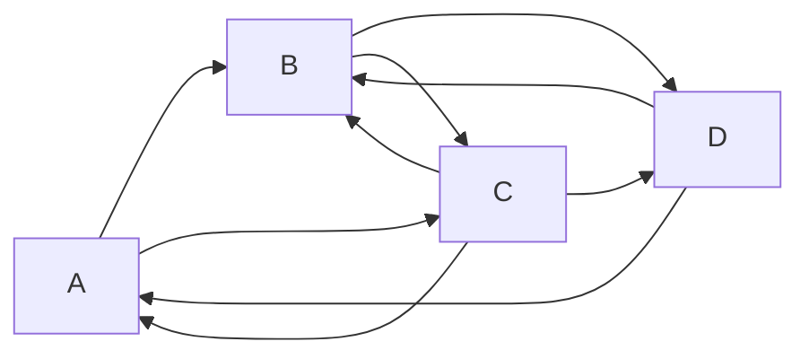

# Group Chat 
punch anthony in the balls
👊👊👊

```js
const arr = ['badger', 'beaver', 'baboon']

arr[Symbol.iterator] = function() {
    let i = 0;
    let arr = this;
    return {
        next: function() {
            if (i >= arr.length) {
                return {done: true};
            } else {
                let char = '';
                if (arr[i] === 'badger') {
                    char = '🦡';
                } else if (arr[i] === 'beaver') {
                    char = '🦫';
                } else {
                    char = '🐵';
                }
                const value = arr[i] + char;
                i++;
                return {value, done: false};
            }
        }
    };
};

for (const i of arr) {
    console.log(i);
}
```

do you understand



